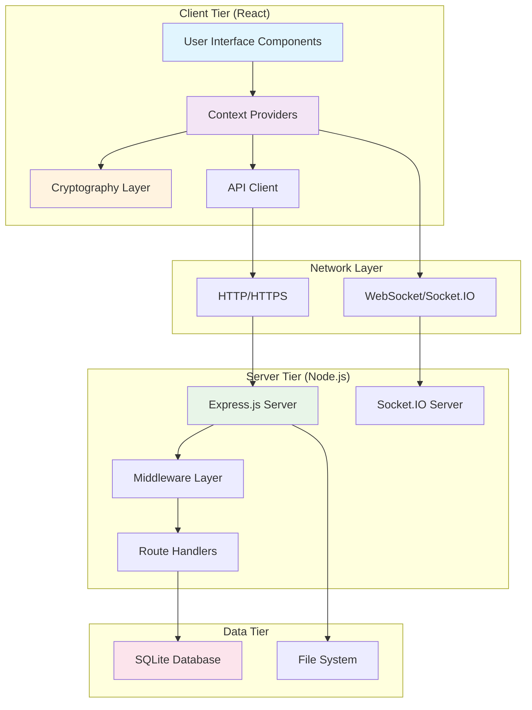
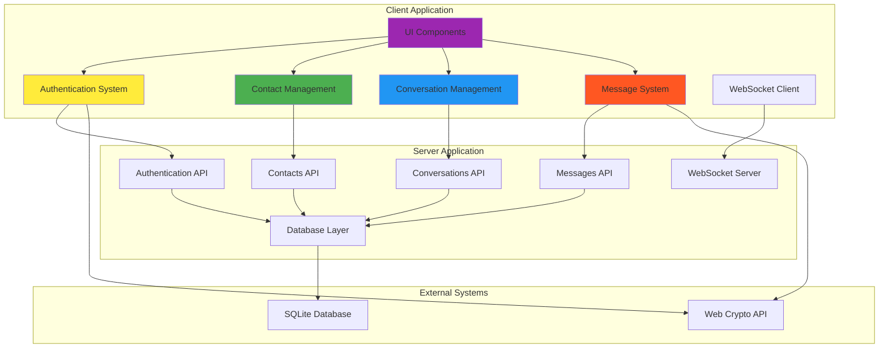
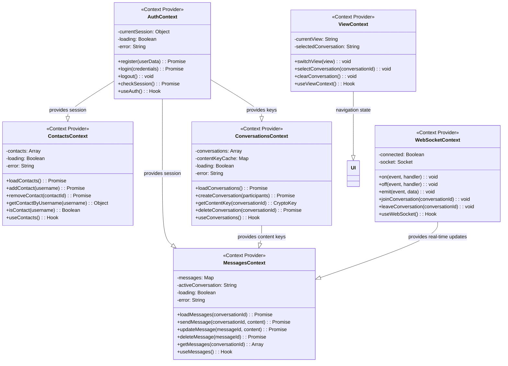
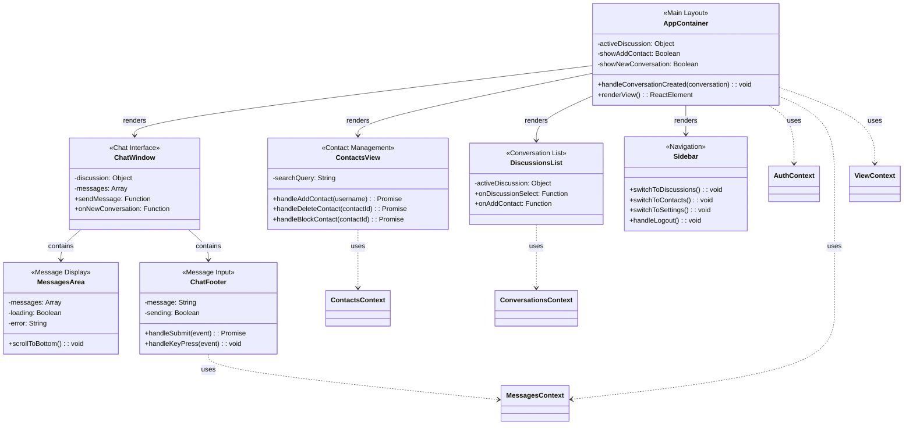
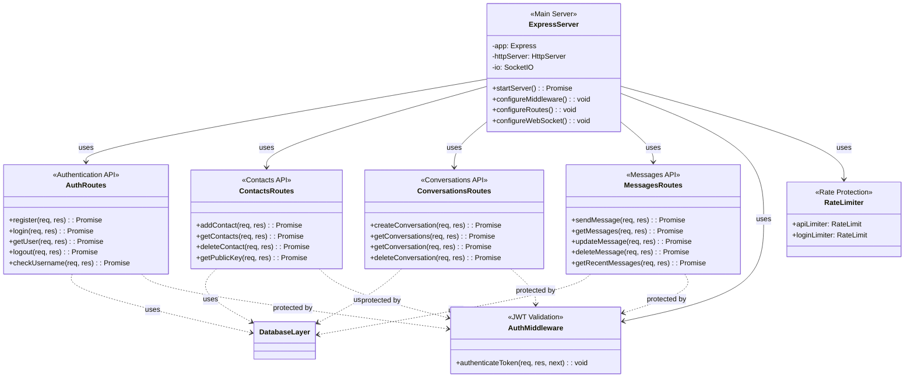
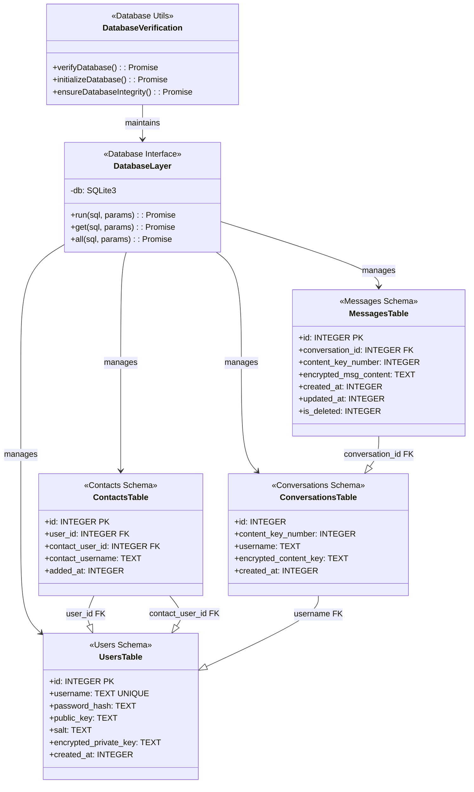
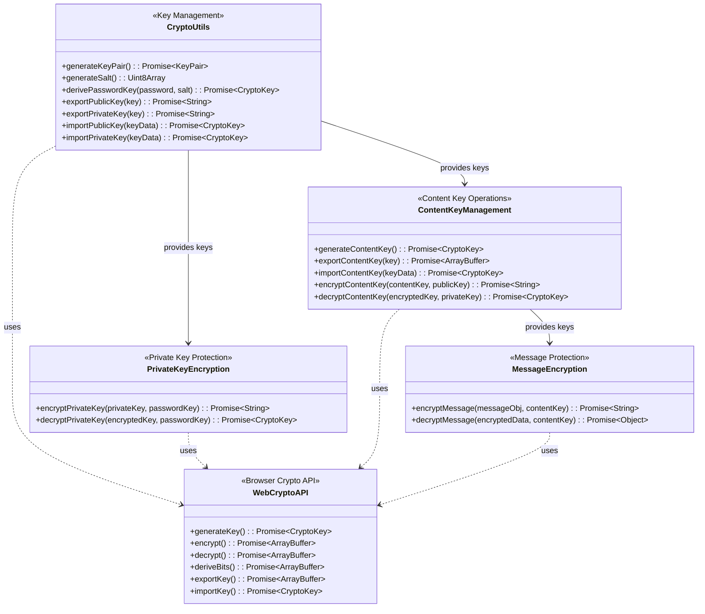
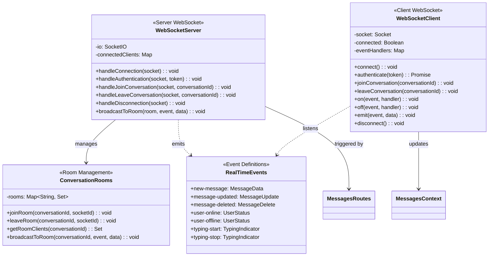

# SecureDove E2EE Messaging App - Architectural Documentation

## Table of Contents
1. [Architectural Overview](#architectural-overview)
2. [Design Patterns Applied](#design-patterns-applied)
3. [Brief Component Diagram](#brief-component-diagram)
4. [Elaborated Component Diagrams](#elaborated-component-diagrams)
5. [Installation & Configuration](#installation--configuration)
6. [Usage Instructions](#usage-instructions)

---

## Architectural Overview

SecureDove follows a **three-tier client-server architecture** with end-to-end encryption, implementing multiple design patterns to ensure security, maintainability, and scalability.

### System Architecture



---

## Design Patterns Applied

### 1. **Context Pattern (React)**
- **Pattern**: Provider Pattern with React Context API
- **Usage**: State management and dependency injection across components
- **Implementation**: 6 context providers managing different concerns

### 2. **Repository Pattern**
- **Pattern**: Data Access Layer abstraction
- **Usage**: Database operations abstracted through helper functions
- **Implementation**: `config/database.js` provides consistent DB interface

### 3. **Middleware Pattern**
- **Pattern**: Chain of Responsibility for request processing
- **Usage**: Authentication, rate limiting, error handling
- **Implementation**: Express.js middleware stack

### 4. **Observer Pattern**
- **Pattern**: Event-driven communication
- **Usage**: Real-time messaging via WebSocket events
- **Implementation**: Socket.IO event system

### 5. **Strategy Pattern**
- **Pattern**: Interchangeable encryption algorithms
- **Usage**: Different cryptographic operations (RSA, AES-GCM, PBKDF2)
- **Implementation**: Modular crypto functions in `utils/crypto.js`

### 6. **MVC Architecture (Modified)**
- **Model**: Context providers and API layer
- **View**: React components
- **Controller**: Context providers + Route handlers

---

## Brief Component Diagram

### High-Level System Components



---

## Elaborated Component Diagrams

### 1. Client-Side Architecture - Context Layer



### 2. Client-Side Architecture - UI Components



### 3. Server-Side Architecture - API Layer



### 4. Server-Side Architecture - Data Layer



### 5. Cryptography Architecture



### 6. WebSocket Real-time Communication



---

## Installation & Configuration

### Prerequisites
- Node.js 18+ 
- npm 9+
- Modern web browser with Web Crypto API support

### Server Setup

1. **Navigate to server directory:**
```bash
cd server
```

2. **Install dependencies:**
```bash
npm install
```

3. **Configure environment:**
```bash
cp .env.example .env
# Edit .env with your configuration
```

4. **Environment Variables:**
```env
# Server Configuration
PORT=8000
NODE_ENV=development

# JWT Secret (Generate a strong random secret for production)
JWT_SECRET=dev-secret-key-please-change-in-production

# Database
DB_PATH=./database/securedove.db

# CORS
CORS_ORIGIN=http://localhost:3000

# Rate Limiting
RATE_LIMIT_WINDOW_MS=900000
RATE_LIMIT_MAX_REQUESTS=100
LOGIN_RATE_LIMIT_WINDOW_MS=900000
LOGIN_RATE_LIMIT_MAX_REQUESTS=5
```

5. **Initialize database:**
```bash
npm run init-db
```

6. **Start server:**
```bash
npm start
# or for development with hot reload:
npm run dev
```

### Client Setup

1. **Navigate to client directory:**
```bash
cd client
```

2. **Install dependencies:**
```bash
npm install
```

3. **Configure environment (optional):**
```bash
# Create .env file if needed
VITE_API_URL=http://localhost:8000/api
```

4. **Start development server:**
```bash
npm run dev
```

5. **Build for production:**
```bash
npm run build
```

### Production Deployment

1. **Server Production Build:**
```bash
# Set production environment
export NODE_ENV=production
export JWT_SECRET=your-strong-production-secret
export DB_PATH=/path/to/production/database
export CORS_ORIGIN=https://your-domain.com
export PORT=3000

# Start server
npm start
```

2. **Client Production Build:**
```bash
# Set production API URL
export VITE_API_URL=https://your-api-domain.com/api

# Build
npm run build

# Serve static files (example with serve)
npx serve -s dist -l 3000
```

---

## Usage Instructions

### 1. User Registration & Authentication

#### Registration Process:
1. Open application at `http://localhost:3000`
2. Click "Sign Up" button
3. Enter desired username (3-20 characters, alphanumeric, underscore, hyphen)
4. Enter secure password (minimum 8 characters recommended)
5. Click "Register" - system will:
   - Generate RSA-2048 key pair client-side
   - Derive password-based encryption key using PBKDF2
   - Encrypt private key with password-derived key
   - Send encrypted data to server
   - Auto-login after successful registration

#### Login Process:
1. Enter username and password
2. Click "Sign In" - system will:
   - Authenticate with server
   - Retrieve user's encrypted private key and salt
   - Derive password-based key locally
   - Decrypt private key in browser memory
   - Establish encrypted session

### 2. Contact Management

#### Adding Contacts:
1. Navigate to "Contacts" view via sidebar
2. Click "Add Contact" button
3. Enter contact's username
4. Click "Add" - system will:
   - Verify user exists on server
   - Retrieve contact's public key
   - Add to contact list

#### Managing Contacts:
- **View all contacts:** Contacts tab shows all added users
- **Remove contact:** Click "Remove" button next to contact
- **Block contact:** Click "Block" button (prevents messaging)

### 3. Conversation Management

#### Creating Conversations:
1. From Discussions view, click "New Conversation"
2. Select one or more contacts from list
3. Click "Create Conversation" - system will:
   - Generate unique conversation ID
   - Create AES-256-GCM content key
   - Encrypt content key with each participant's public key
   - Store encrypted keys on server
   - Cache decrypted key locally

#### Conversation Features:
- **View conversations:** All conversations appear in left panel
- **Select conversation:** Click on conversation to view messages
- **Delete conversation:** Use conversation options menu

### 4. Messaging System

#### Sending Messages:
1. Select a conversation from the list
2. Type message in input field at bottom
3. Press Enter or click send button - system will:
   - Create message object with sender, timestamp, content
   - Encrypt message with conversation's content key
   - Send encrypted message to server
   - Display message immediately in chat
   - Broadcast to other participants via WebSocket

#### Message Features:
- **Real-time delivery:** Messages appear instantly for all participants
- **Message history:** Scroll up to load older messages
- **Message editing:** Right-click message to edit (future feature)
- **Message deletion:** Right-click to delete messages

#### Message Encryption Flow:
```
User Input → Message Object → AES Encryption → Server Storage
                ↓
Client Display ← Message Decrypt ← Real-time Broadcast ← WebSocket
```

### 5. Security Features

#### End-to-End Encryption:
- **Key Generation:** RSA-2048 key pairs generated locally
- **Private Key Protection:** Encrypted with PBKDF2-derived key
- **Content Keys:** Unique AES-256-GCM key per conversation
- **Message Encryption:** All message content encrypted before transmission

#### Session Security:
- **Memory-Only Keys:** Private keys never stored persistently
- **JWT Tokens:** 24-hour expiration with secure validation
- **Session Timeout:** Automatic logout after 30 minutes inactivity
- **Secure Storage:** Only encrypted data stored on server

#### Network Security:
- **HTTPS Required:** Production deployment uses TLS
- **Rate Limiting:** Protection against brute force attacks
- **Input Validation:** All inputs sanitized and validated
- **CORS Protection:** Configured for specific origins

### 6. Advanced Usage

#### WebSocket Connection:
- **Auto-connect:** Establishes connection on login
- **Room Management:** Joins conversation rooms automatically
- **Reconnection:** Automatic reconnection on network issues
- **Event Handling:** Real-time message delivery and updates

#### Cryptographic Operations:
- **Key Rotation:** Content keys can be rotated for forward secrecy
- **Key Verification:** Public key fingerprints for identity verification
- **Secure Deletion:** Keys cleared from memory on logout
- **Backup & Recovery:** Export/import functionality (future feature)

### 7. Troubleshooting

#### Common Issues:

**Cannot login:**
- Verify username and password
- Check network connectivity
- Clear browser cache and localStorage

**Messages not appearing:**
- Check WebSocket connection status
- Verify conversation membership
- Refresh page to reload messages

**Encryption errors:**
- Ensure browser supports Web Crypto API
- Check for blocked third-party cookies
- Verify secure context (HTTPS in production)

#### Debug Information:
Access browser developer console for detailed logging:
- Authentication events
- WebSocket connection status
- Message encryption/decryption
- Network requests

#### Performance Optimization:
- **Message Pagination:** Loads 50 messages at a time
- **Key Caching:** Content keys cached during session
- **Batch Operations:** Multiple messages processed in parallel
- **Memory Management:** Automatic cleanup on logout

---

## Security Considerations

### Client-Side Security:
- Private keys never leave browser memory
- All cryptographic operations performed locally
- Input sanitization prevents XSS attacks
- Session management with automatic timeouts

### Server-Side Security:
- Zero-knowledge architecture (no plaintext access)
- Bcrypt password hashing with high cost factor
- JWT authentication with expiration
- Rate limiting and request validation
- SQL injection prevention with parameterized queries

### Network Security:
- HTTPS required for production
- WebSocket over TLS (WSS)
- CORS configuration for specific origins
- Security headers via Helmet.js

### Data Security:
- End-to-end encryption for all messages
- Encrypted private key storage
- Secure key derivation (PBKDF2)
- Forward secrecy with key rotation capability

---

## Performance Metrics

### Target Performance:
- **Message Encryption:** < 100ms
- **Message Decryption:** < 50ms
- **Page Load:** < 2 seconds
- **Real-time Delivery:** < 1 second
- **Database Operations:** < 10ms average

### Scalability Considerations:
- SQLite suitable for moderate user bases
- WebSocket connection pooling
- Message pagination for large conversations
- Content key caching for performance
- Future: PostgreSQL migration for larger scale

---

## License

MIT License - see LICENSE file for details.

---

## Contributing

Please read CONTRIBUTING.md for development guidelines and contribution process.