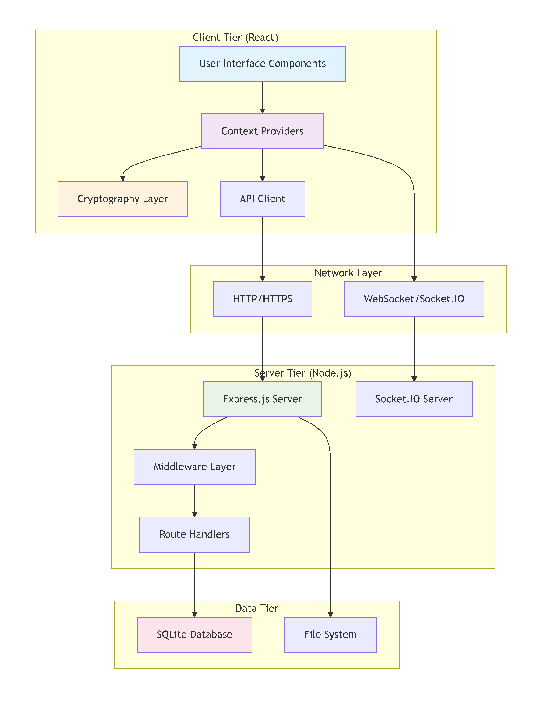

# Architecture Design
## Description
SecDove is a secure messaging web application. It uses a client-server architecture.

### Client
- Gives a User Interface for utilizing app features
- Handles encryption/decryption of messages
- Handles key generation
- Sends encrypted messages to server
- Stores temporary data in browser (JWT to keep logged in, private key stored in local storage)

### Server
- Handles Authentication process of users
- Stores account data (hashed+salted password)
- Stores encrypted messages
- Stores conversation keys

## High-Level Architecture Diagram

