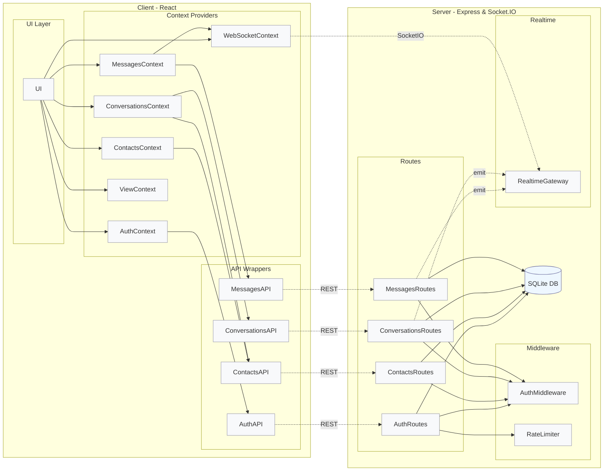
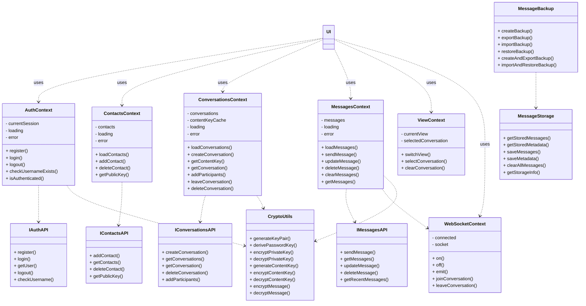
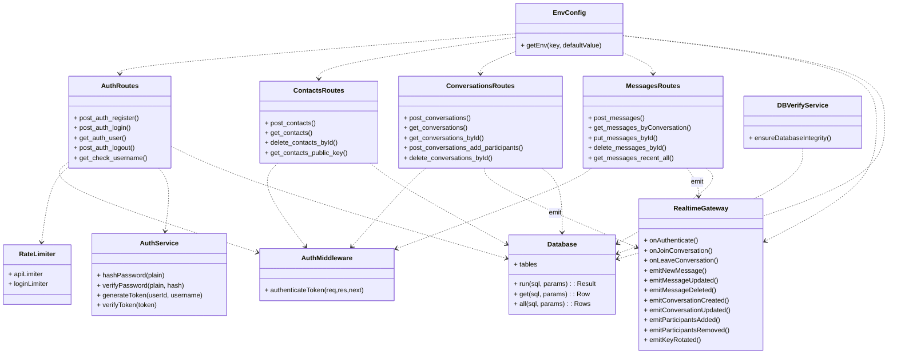

# SecureDove Architecture

This document summarizes the architecture and components using only information from this `documentation/` folder. It includes Mermaid versions of the PlantUML diagrams and concise supporting text based on `documentation/README.md`.

## Overview

- Patterns: Client–Server, Layered. The server uses modular routing (controller-like routes) with middleware for cross‑cutting concerns and a persistence layer. The client uses React Context/Provider with hooks; REST API wrappers and a WebSocket provider support data and realtime.
- Trust model: Zero‑knowledge server for message content and private keys. All cryptography for message payloads is client‑side.

## Architecture Brief

## Client Components (Elaborated)

## Server Components (Elaborated)

## User Use Cases

```mermaid
flowchart LR
  classDef actor fill:#fffce6,stroke:#b59b00,stroke-width:1px
  classDef uc fill:#f0f7ff,stroke:#678,stroke-width:1px

  User([User])
  class User actor

  subgraph AUTH[Authentication]
    U1[Register - RSA keypair; encrypt private key]
    U2[Check Username Availability]
    U3[Login - decrypt private key]
    U4[Logout]
    class U1,U2,U3,U4 uc
  end

  subgraph CONTACTS[Contacts]
    U5[Add Contact]
    U6[List Contacts]
    U7[Remove Contact]
    U8[Fetch Contact Public Key]
    class U5,U6,U7,U8 uc
  end

  subgraph CONVOS[Conversations]
    U9[Create Conversation - wrap content key per participant]
    U10[List Conversations]
    U11[Open Conversation]
    U12[Delete Conversation - leave]
    U13[Add Participants - share history]
    U14[Add Participants - rotate key]
    class U9,U10,U11,U12,U13,U14 uc
  end

  subgraph MSG[Messaging]
    U15[Send Message - AES-GCM]
    U16[Receive Real-time Message]
    U17[Load Message History]
    U18[Edit Message]
    U19[Delete Message]
    class U15,U16,U17,U18,U19 uc
  end

  subgraph RT[Realtime]
    U20[Join Conversation Channel]
    U21[Leave Conversation Channel]
    U22[Receive System Events - participants/key]
    class U20,U21,U22 uc
  end

  subgraph BAK[Backup & Local Data]
    U23[Create or Export Backup - encrypted content]
    U24[Import or Restore Backup]
    U25[Clear Local Messages]
    class U23,U24,U25 uc
  end

  User --> U1
  User --> U2
  User --> U3
  User --> U4
  User --> U5
  User --> U6
  User --> U7
  User --> U8
  User --> U9
  User --> U10
  User --> U11
  User --> U12
  User --> U13
  User --> U14
  User --> U15
  User --> U16
  User --> U17
  User --> U18
  User --> U19
  User --> U20
  User --> U21
  User --> U22
  User --> U23
  User --> U24
  User --> U25
```

## Installation

Prerequisites
- Node.js LTS (v18+ recommended)
- npm (bundled with Node)

Clone and install
- Run `npm install` in both `server/` and `client/` (see `documentation/README.md`).

Server environment
- Create `server/.env` with example defaults:
  - `PORT=8000`
  - `NODE_ENV=development`
  - `JWT_SECRET=<set-a-strong-secret>`
  - `DB_PATH=./database/securedove.db`
  - `CORS_ORIGIN=http://localhost:5173`
  - `RATE_LIMIT_WINDOW_MS=900000` and `RATE_LIMIT_MAX_REQUESTS=100`
  - `LOGIN_RATE_LIMIT_WINDOW_MS=900000` and `LOGIN_RATE_LIMIT_MAX_REQUESTS=5`

Client environment
- Create `client/.env` with:
  - `VITE_API_URL=http://localhost:8000/api`
  - Optionally: `VITE_SOCKET_URL=http://localhost:8000`

Database
- Initialize SQLite:
  - `cd server && npm run init-db`
  - Verify (optional): `npm run verify-db`

## Running

Option A: helper script
- From repo root: `./start.sh` (or `start.bat` on Windows)

Option B: separate
- Server: `cd server && npm run dev` (or `npm start`)
- Client: `cd client && npm run dev` (Vite dev server)

## Usage

1) Register and Login
- Registration generates an RSA keypair client‑side; the private key is encrypted with a password‑derived key and stored server‑side only in encrypted form. Login decrypts the private key client‑side after JWT authentication.

2) Contacts
- Add/remove/list contacts; fetch public keys for secure key wrapping.

3) Conversations
- Create with per‑participant wrapped content keys. Add participants either by:
  - Sharing history (re‑wrap historical keys), or
  - Rotating to a new content key (incremented key number).
- Leave/delete removes current user membership and emits a system event.

4) Messaging
- Messages are encrypted client‑side (AES‑GCM) with the conversation content key. Realtime delivery uses Socket.IO; history is fetched via REST and decrypted locally. Edit/delete operations update or remove encrypted payloads; system events appear as broadcast items.

5) Backup & Local Data
- Create/export a backup (JSON) of encrypted messages/metadata. Import/restore to merge or replace local data. Optionally clear all local messages.

## Notes

- Security: The server never handles plaintext messages or private keys; use HTTPS and a strong JWT secret in production.
- CORS/WebSocket: Match `CORS_ORIGIN` to the client dev server and `VITE_SOCKET_URL` to the server origin.
